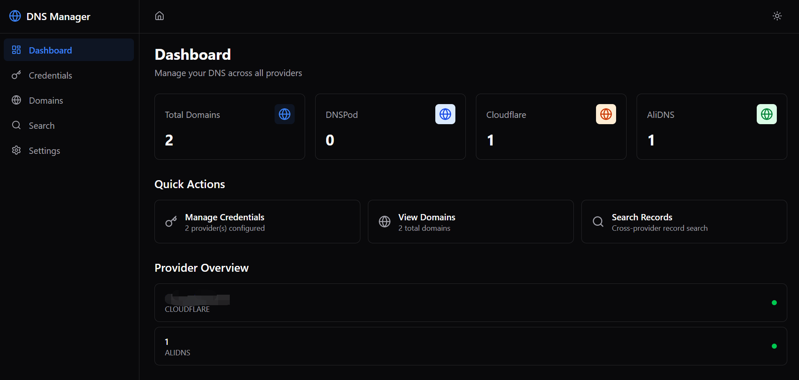

# DNS Manager

> 基于 Tauri 2.x 构建的 Windows 桌面应用，通过 API 聚合统一管理 **DNSPod**、**Cloudflare** 和 **阿里云 AliDNS** 上的域名与 DNS 记录。



---

## 特性

- **多提供商聚合** — 单个界面管理 DNSPod、Cloudflare、阿里云 AliDNS 的域名
- **完整 DNS CRUD** — 支持 A、AAAA、CNAME、MX、TXT、NS、SRV、CAA、SOA、PTR 记录增删改查
- **跨提供商搜索** — 在所有平台中搜索 DNS 记录，支持按提供商和记录类型过滤
- **Zone 文件导出** — 将域名 DNS 记录导出为标准 BIND zone 文件格式
- **凭据安全存储** — API 密钥/Token 加密存储于 Windows 凭据管理器 (DPAPI)，**永不传递到前端**
- **深色/浅色主题** — 支持跟随系统或手动切换
- **并发聚合查询** — 后端使用 `tokio::spawn` 并发请求所有提供商，部分失败不影响整体
- **智能重试** — 指数退避 + 随机抖动，自动处理速率限制

## 技术栈

| 层级                  | 技术                                                     | 说明                                      |
| --------------------- | -------------------------------------------------------- | ----------------------------------------- |
| **桌面框架**    | [Tauri 2.x](https://v2.tauri.app/)                          | Rust 后端 + WebView 前端                  |
| **前端语言**    | TypeScript 5                                             | 类型安全的 IPC 通信                       |
| **UI 框架**     | React 18 +[React Router](https://reactrouter.com/) v7       | SPA 路由                                  |
| **样式方案**    | [Tailwind CSS](https://tailwindcss.com/) v4 + Radix UI 组件 | 深色/浅色主题                             |
| **图标库**      | [Lucide React](https://lucide.dev/)                         | 一致性图标集                              |
| **后端语言**    | Rust (edition 2021, MSRV 1.77.2)                         | Tauri 原生后端                            |
| **异步运行时**  | [tokio](https://tokio.rs/)                                  | 并发 HTTP + IPC 处理                      |
| **HTTP 客户端** | [reqwest](https://docs.rs/reqwest/) 0.12                    | 原生 TLS + JSON 自动序列化                |
| **凭据存储**    | [keyring](https://crates.io/crates/keyring) v3              | Windows Credential Manager 安全存储       |
| **API 签名**    | hmac + sha2 + sha1 + base64                              | DNSPod TC3-HMAC-SHA256 / AliDNS HMAC-SHA1 |

## 系统要求

- **操作系统**: Windows 10/11 (仅支持 Windows)
- **Node.js**: >= 18.0.0
- **Rust**: >= 1.77.2
- **Microsoft Visual C++ Build Tools** (用于编译 Rust 原生依赖)

## 快速开始

### 环境准备

1. 安装 [Node.js](https://nodejs.org/) (推荐 20.x LTS 或更高)
2. 安装 [Rust](https://rustup.rs/)：
   ```bash
   curl --proto '=https' --tlsv1.2 -sSf https://sh.rustup.rs | sh
   ```
3. 安装 [Microsoft Visual C++ Build Tools](https://visualstudio.microsoft.com/visual-cpp-build-tools/)（选择 "Desktop development with C++" 工作负荷）

### 克隆与安装

```bash
# 进入项目目录
cd dns-manager

# 安装前端依赖
npm install
```

### 开发模式

```bash
# 启动 Tauri 开发窗口（自动启动 Vite dev server + 热重载）
npm run tauri dev
```

### 生产构建

```bash
# 构建 Windows MSI 安装包
npm run tauri build
```

构建产物位于 `src-tauri/target/release/bundle/` 目录。

## 项目结构

```
dns-manager/
├── src/                              # React 前端
│   ├── main.tsx                      # 入口
│   ├── App.tsx                       # 路由配置
│   ├── index.css                     # Tailwind 指令 + CSS 变量
│   ├── components/
│   │   ├── layout/
│   │   │   ├── AppShell.tsx          # 侧边栏 + 内容区布局
│   │   │   ├── Sidebar.tsx           # 导航侧边栏
│   │   │   └── Header.tsx            # 面包屑 + 主题切换
│   │   └── common/
│   │       ├── ProviderBadge.tsx     # 提供商标签
│   │       ├── RecordTypeBadge.tsx   # 记录类型标签
│   │       ├── ConfirmDialog.tsx     # 确认对话框
│   │       ├── LoadingSpinner.tsx    # 加载指示器
│   │       └── ErrorAlert.tsx        # 错误提示（含重试）
│   ├── routes/
│   │   ├── Dashboard.tsx             # 仪表盘（统计 + 快捷操作）
│   │   ├── Credentials.tsx           # 凭据管理（增删测）
│   │   ├── Domains.tsx               # 域名列表（多提供商聚合）
│   │   ├── DomainDetail.tsx          # DNS 记录 CRUD
│   │   ├── Search.tsx                # 全局搜索
│   │   └── Settings.tsx              # 主题设置 + 关于
│   ├── context/
│   │   ├── AppContext.tsx            # 全局状态（凭据列表）
│   │   └── ThemeContext.tsx          # 主题控制
│   ├── lib/
│   │   ├── tauri.ts                  # 类型化 IPC 调用封装
│   │   └── utils.ts                  # cn() 工具 + 颜色映射
│   └── types/
│       └── index.ts                  # TypeScript 接口定义
│
├── src-tauri/                        # Rust 后端
│   ├── Cargo.toml
│   ├── tauri.conf.json
│   ├── src/
│   │   ├── main.rs                   # 程序入口
│   │   ├── lib.rs                    # Tauri 构建器 + 命令注册
│   │   ├── models/
│   │   │   ├── credential.rs         # ProviderCredential, CredentialSecretData
│   │   │   ├── domain.rs             # Domain, DomainSummary
│   │   │   ├── record.rs             # DnsRecord, RecordType, Create/UpdateRequest
│   │   │   └── search.rs             # SearchQuery, SearchResult
│   │   ├── providers/
│   │   │   ├── mod.rs                # DnsProvider trait + 工厂函数
│   │   │   ├── cloudflare.rs         # Cloudflare REST API v4
│   │   │   ├── dnspod.rs             # DNSPod (腾讯云 API v3 签名)
│   │   │   └── alidns.rs             # AliDNS (阿里云 HMAC-SHA1 签名)
│   │   ├── commands/
│   │   │   ├── credentials.rs        # 凭据 Tauri 命令
│   │   │   ├── domains.rs            # 域名聚合命令
│   │   │   ├── records.rs            # DNS 记录 CRUD 命令
│   │   │   ├── export.rs             # Zone 文件导出命令
│   │   │   └── shared.rs             # 共享工具函数
│   │   ├── security/
│   │   │   └── credential_manager.rs # Windows 凭据管理器封装
│   │   ├── error.rs                  # 统一错误类型
│   │   └── retry.rs                  # 指数退避重试策略
│   └── capabilities/
│       └── default.json              # Tauri 2.x 权限配置
│
├── package.json
├── tsconfig.json
├── vite.config.ts
└── index.html
```

## 架构概览

### 通信流

```
React 前端
    │ invoke("command", args)
    ▼
Tauri IPC Bridge (serde JSON)
    │
    ▼
Rust Command Handler
    │
    ├──► Provider Factory ──► DnsProvider trait
    │         │
    │         ├──► CloudflareProvider  ──► api.cloudflare.com
    │         ├──► DnsPodProvider      ──► dnspod.tencentcloudapi.com
    │         └──► AliDnsProvider      ──► alidns.aliyuncs.com
    │
    └──► Credential Manager ──► Windows 凭据管理器 (DPAPI)
```

### 安全设计

| 安全特性 | 实现                                                                                       |
| -------- | ------------------------------------------------------------------------------------------ |
| 凭据隔离 | 秘密数据仅存在于 Rust 后端内存，**前端只获取 metadata** (id + label + provider_type) |
| 存储加密 | Windows 凭据管理器使用 DPAPI 加密，绑定当前用户                                            |
| 日志安全 | `CredentialSecretData` Debug 实现完全遮盖敏感字段                                        |
| 传输加密 | 所有 API 调用强制 HTTPS (reqwest 默认 TLS 验证)                                            |
| 独立存储 | 每条凭据单独存储（target:`dns-manager/{uuid}`），元数据与秘密分离                        |
| CSP 限制 | `default-src 'self'`，禁止外部资源加载                                                   |

### Provider 抽象

所有提供商实现统一的 `DnsProvider` trait：

```rust
#[async_trait]
pub trait DnsProvider: Send + Sync {
    async fn list_domains(&self) -> Result<Vec<Domain>, ProviderError>;
    async fn list_records(&self, domain_id: &str) -> Result<Vec<DnsRecord>, ProviderError>;
    async fn create_record(&self, domain_id: &str, record: &CreateRecordRequest) -> Result<DnsRecord, ProviderError>;
    async fn update_record(&self, domain_id: &str, record_id: &str, record: &UpdateRecordRequest) -> Result<DnsRecord, ProviderError>;
    async fn delete_record(&self, domain_id: &str, record_id: &str) -> Result<(), ProviderError>;
    async fn search_records(&self, domain_id: &str, query: &str) -> Result<Vec<DnsRecord>, ProviderError>;
    async fn export_zone(&self, domain_id: &str) -> Result<String, ProviderError>;
    fn provider_type(&self) -> ProviderType;
}
```

| 提供商                  | API 端点                         | 认证方式                                    |
| ----------------------- | -------------------------------- | ------------------------------------------- |
| **Cloudflare**    | `api.cloudflare.com/client/v4` | Bearer API Token                            |
| **DNSPod**        | `dnspod.tencentcloudapi.com`   | TC3-HMAC-SHA256 签名 (SecretId + SecretKey) |
| **阿里云 AliDNS** | `alidns.aliyuncs.com`          | HMAC-SHA1 签名 (AccessKey ID + Secret)      |

## 使用指南

### 1. 添加凭据

1. 进入 **Credentials** 页面，点击 **Add Credential**
2. 选择提供商，填写 Label 和对应的 API 凭据：

| 提供商     | 所需凭据                        | 获取方式                                                                                        |
| ---------- | ------------------------------- | ----------------------------------------------------------------------------------------------- |
| Cloudflare | API Token                       | [Cloudflare Dashboard](https://dash.cloudflare.com/profile/api-tokens) → Create Token → DNS:Edit |
| DNSPod     | SecretId + SecretKey            | [腾讯云控制台](https://console.cloud.tencent.com/cam/capi) → API 密钥管理                         |
| AliDNS     | AccessKey ID + AccessKey Secret | [阿里云 RAM](https://ram.console.aliyun.com/manage/ak) → 创建 AccessKey                           |

3. 保存后点击 **Test** 验证连接

### 2. 查看域名

进入 **Domains** 页面，自动列出所有已配置提供商的域名。可按提供商过滤或点击刷新。

### 3. 管理 DNS 记录

1. 点击域名进入 **DomainDetail** 页面
2. 查看当前所有 DNS 记录
3. 点击 **Add Record** 添加新记录：
   - 选择记录类型 (A/AAAA/CNAME/MX/TXT 等)
   - 填写 Name、Content、TTL
   - Cloudflare 域名额外支持 Proxy 模式
4. 点击 **Edit** 修改记录，点击垃圾桶图标删除
5. 点击 **Export Zone** 导出 BIND 格式 zone 文件

### 4. 全局搜索

进入 **Search** 页面，输入关键词搜索所有提供商中的 DNS 记录。支持按提供商和记录类型过滤。

## Tauri 命令列表

前端通过 IPC 调用的 14 个 Rust 命令：

| 命令                   | 参数                                                  | 返回值                      | 说明                          |
| ---------------------- | ----------------------------------------------------- | --------------------------- | ----------------------------- |
| `get_credentials`    | —                                                    | `Vec<ProviderCredential>` | 获取凭据列表（无秘密）        |
| `save_credential`    | `CredentialInput`                                   | `ProviderCredential`      | 保存凭据（秘密存入 Keychain） |
| `delete_credential`  | `Uuid`                                              | `()`                      | 删除凭据                      |
| `test_credential`    | `Uuid`                                              | `bool`                    | 测试凭据连接                  |
| `list_domains`       | `Option<Vec<ProviderType>>`                         | `Vec<Domain>`             | 跨提供商域名列表              |
| `get_domain`         | `ProviderType, String`                              | `Domain`                  | 单域名详情                    |
| `get_domain_summary` | —                                                    | `DomainSummary`           | 域名数量统计                  |
| `list_records`       | `ProviderType, String`                              | `Vec<DnsRecord>`          | DNS 记录列表                  |
| `create_record`      | `ProviderType, String, CreateRecordRequest`         | `DnsRecord`               | 创建记录                      |
| `update_record`      | `ProviderType, String, String, UpdateRecordRequest` | `DnsRecord`               | 更新记录                      |
| `delete_record`      | `ProviderType, String, String`                      | `()`                      | 删除记录                      |
| `search_records`     | `SearchQuery`                                       | `Vec<SearchResult>`       | 跨提供商搜索                  |
| `export_zone`        | `ProviderType, String`                              | `String`                  | 导出 zone 文件                |

## 许可证

[MIT](LICENSE)

---

**DNS Manager** — 一个面向多平台 DNS 管理的轻量级桌面工具，将 DNSPod、Cloudflare 和阿里云 AliDNS 的控制台整合到一个统一界面中。
